# 06-assignment
 Build off on the notify app

## Errors 
I was doing fine for the most part but then I kept getting errors with using the Digital Ocean console. 

### The console needing to reload 
I pressed the Launch Droplet Console to enter the password but it wouldn't load no matter how much I waited and press enter. I would go into Launch Recovery Console to enter the password. 

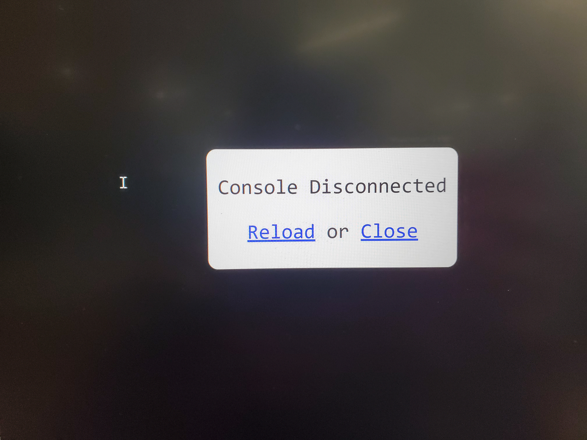 
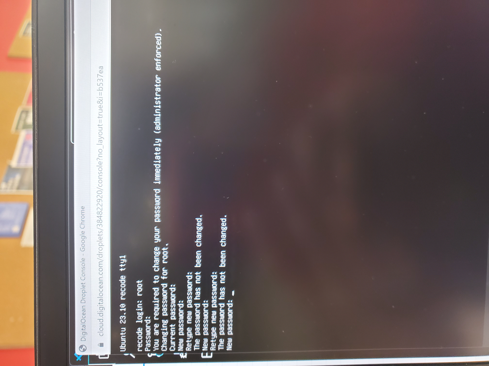 

It took me a while to figure out why the password wasn't working. 
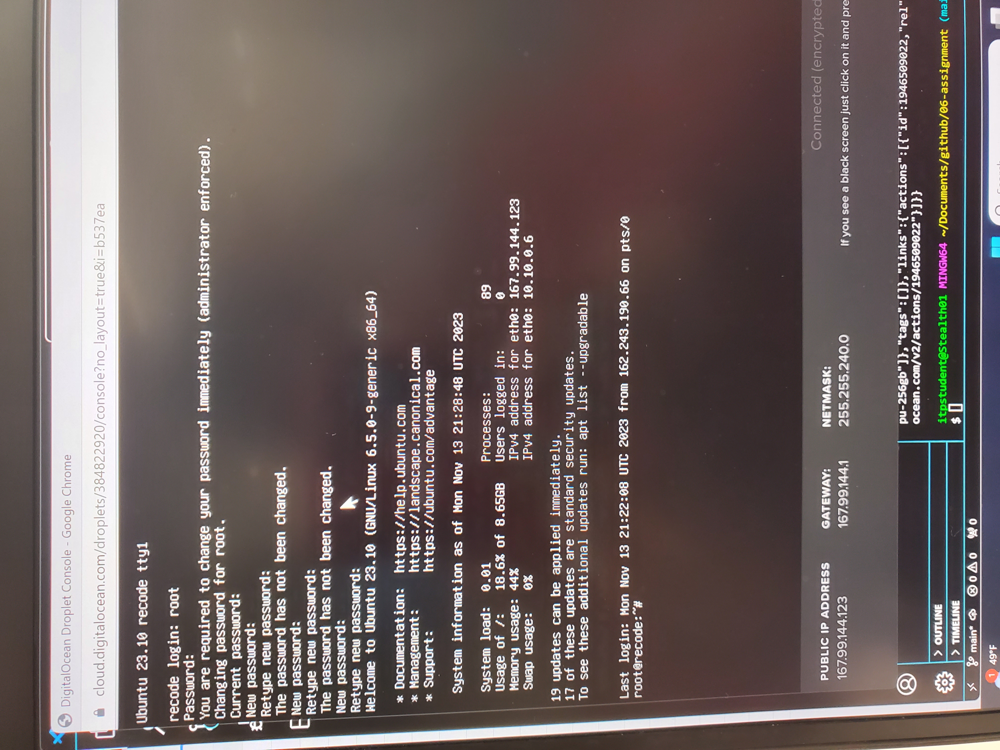 

### Pink Screen 
When I was installing npm, I would get this screen: 
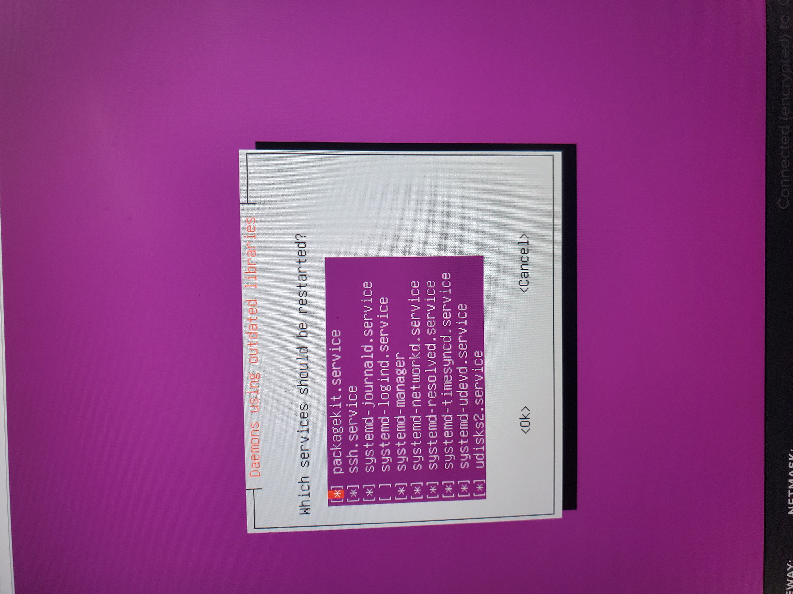 
I don't know what it meant by Daemons using outdated libraries but no matter what I pressed, I would be stuck on this screen, I would then have to reset the droplet console progress. 

### An error with nodejs 
After resetting the console, I got this error trying to install nodejs. It worked the first time so I don't know where this error came from so I resetted the droplet all together. 
 
It worked again when I resetted it but I'm still getting an error with the npm install. I don't know what's happening or if it has anything to do with the laptop I'm using. 

## Fixed Errors 
Restting the droplet seem to work since the nodejs and npm install and the pm2 install workked fine. I saw a warning but it seem to do nothing much. 
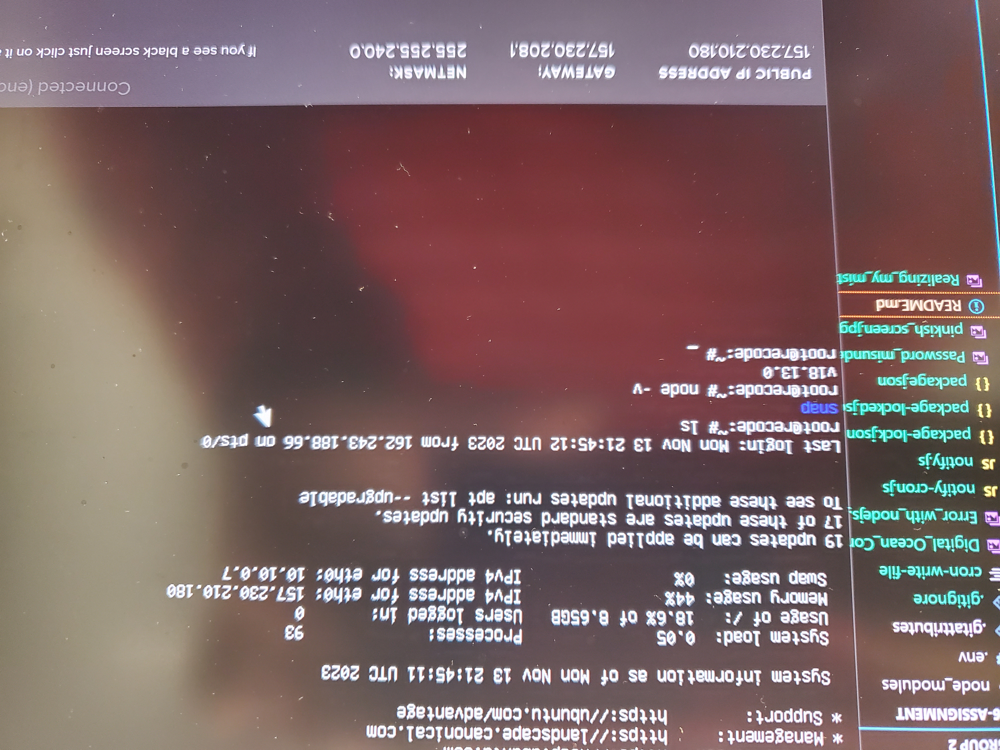 
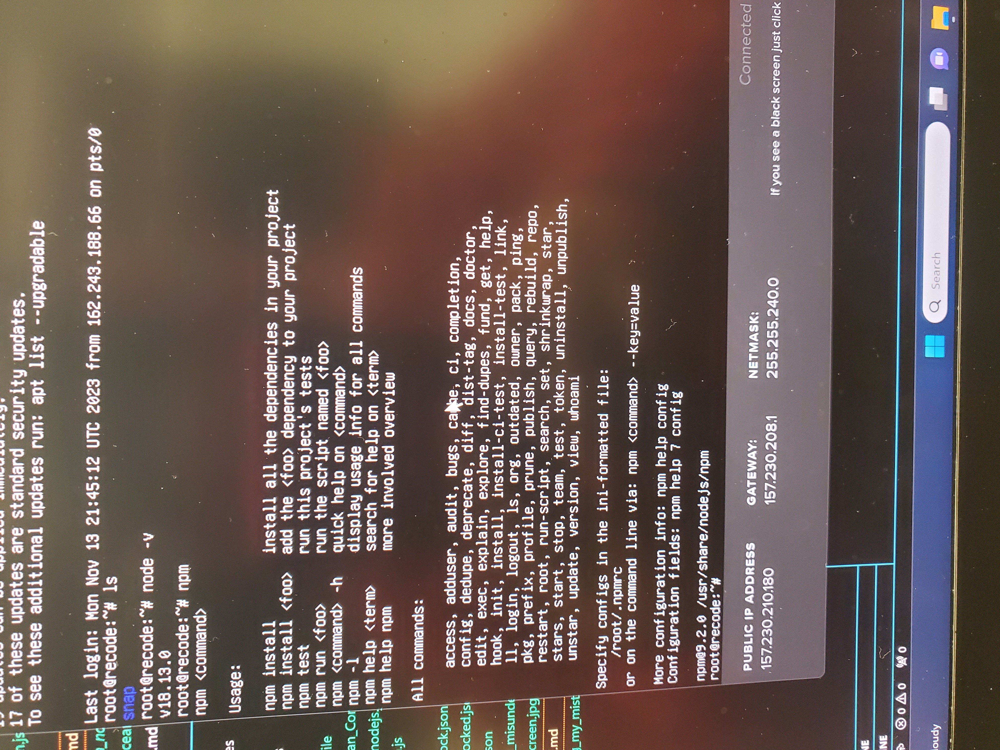  
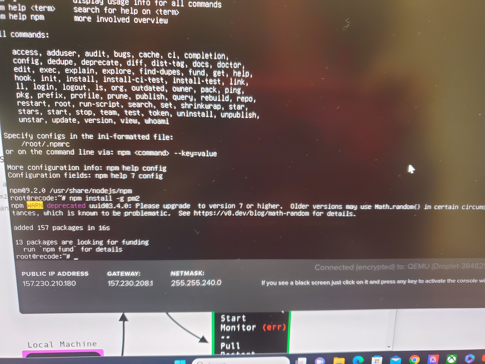 

### The last steps 
it took me a while to realize I was typing the git clone command in the wrong terminal, I didn't kn ow how I would missed that. But I got my respository to be cloned. I used the npm install dotenv command and seemed to work though I think I'm missing a step. The pm2 seems to work fine at first but then it gets errors. I have yet to get a notification that I scheduled for every 12 hours. 
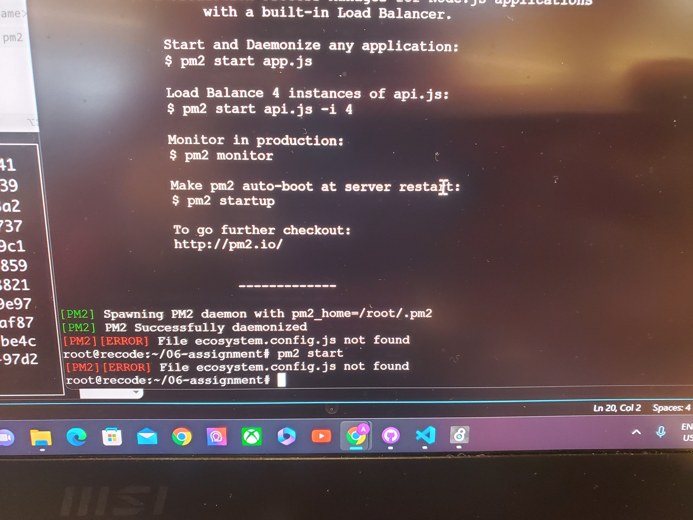 
 
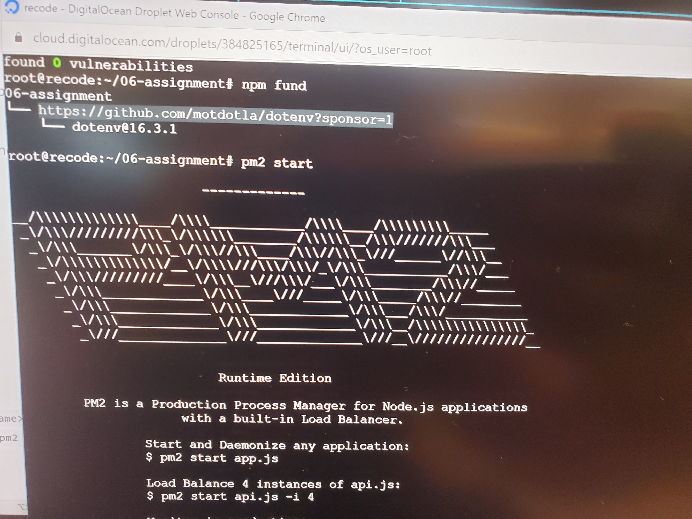

## Notifications 
The Notifications seem to work but I have yet to understand how to install a dotenv file. Though there was this one time I was getting notifications 10-20 minutes after class. There was another time where I was getting notifications on Friday randomly and I didn't even edit the code or anything since Thursday. 
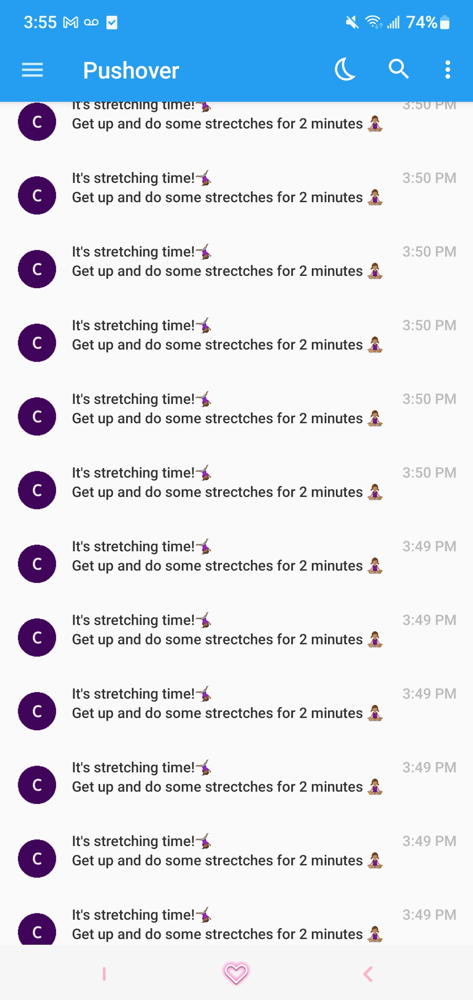 
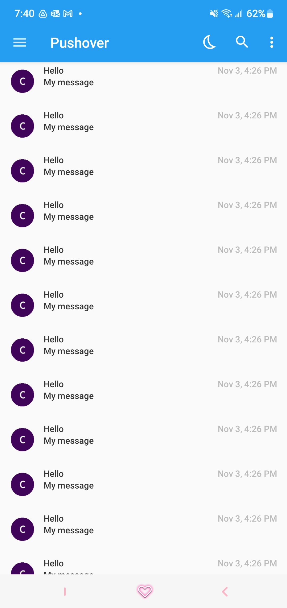 

## The Process 
I found this assignment to be pretty difficult but also kinda fun and interesting. There many times I was stumped and had no idea what to do but then I would look into the resources and look thoroughly at my code to see the mistakes I made and correct them by myself. It was rewarding to see how I'm having a better grasp at the material. I'm still confused about adding a .env file to the droplet but I managed to understand everything else. Though I'm glad I was able to understand the material by myself, I still feel like I should have utilize office hours even if I couldn't find a time best suited for me the week.